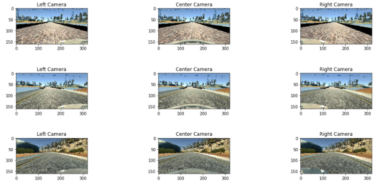
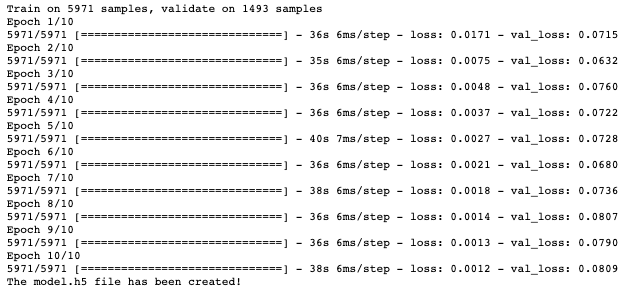

# Behavioral Cloning Project

Overview
---

(Vehicle driving autonomously)

In this project, a convolutional neural network is trained to clone a driving behavior from a simulator.
The CNN architecture used here is referenced from NVIDIA's ***End to End Learning for Self-Driving Cars paper***.   
**Reference:** https://arxiv.org/pdf/1604.07316v1.pdf

This repository contains follwoing five files: 
* model.py (script to create and train the model)
* drive.py (script to drive the car - feel free to modify this file)
* model.h5 (a trained Keras model)
* a report writeup file (the document you are reading right now)
* video.mp4 (a video recording of the vehicle driving autonomously around the track for one full lap)

The Goal of the Project 
---
The goal is to create and to validate of a CNN model that clones a driving behavior from a simulator.  
Simulator allows to collect data in the format shown below:

Here, only 3 camera images (center, left, right) and corresponding steering angles are used to train the model.  
Thus, the outcome of the model is the steering angle.  

Data Collection Strategy
---
The data is collected via the simulator.  
While collecting the data, 3 loops has been conducted as follows:
1. One round of data was collected by **staying in the middle line** as much as possible and making **smooth turns**
2. The vehicle was driven in the opposite direction for one turn. In fact, this stage was not necessary because the data collected in the previous round in the data augmentation stage was flip. As a result, data was doubled in both directions with the data augmentation.
3. In the third round, short rides were made from sharp places with different patterns to the middle line.

The Pipeline
---
The pipeline consist of, six steps as follows: (Step 0 is importing the required libraries),  
1. Loading the raw data

2. Dataset Summary & Visual Exploration
* The dataset contains 7464 camera images in total (2488 images per camera)
* Random 3 camera sets were visualized to check whether the data is imported successfully  

3. Data Augmentation
* Images are cropped to remove irrelevant parts of the images (the hood and the sky)
* Image are flipped and their corresponding steering angles are multiplied by -1

4. Image Pre-Processing
* Here the image is only and only resized
* Since the outcome of the architecture is good as expected, no further image processing applied

5. Creating the CNN Architecture using Keras
* Following CNN architecture is used as shown below:

The CNN architecture is used from NVIDIA's End to End Learning for Self-Driving Cars paper.
Reference: https://arxiv.org/pdf/1604.07316v1.pdf

6. Compiling and Saving the Model
* Finally, the model is compiled using **Mean Square Error (MSE)** loss function and **Adaptive moment estimation** optimizer (a.k.a adam)  

Initially, the number of epochs is set to 10.  
However, the validation loss is started to increase after the 6th epoch progressively.  
Thus, the number of **epochs** is set to 6!  

### Dependencies
This repository also includes a file requirements.txt that contains required dependencies.  
Also, the pipeline.ipynb file includes the required Python libraries.

### Suggestions
To improve the success of the network, some suggestions are followed:
* Once

